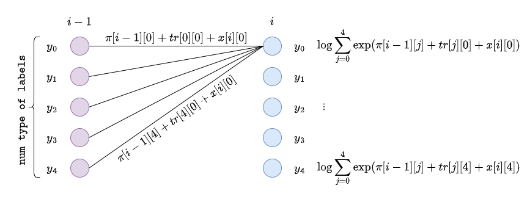
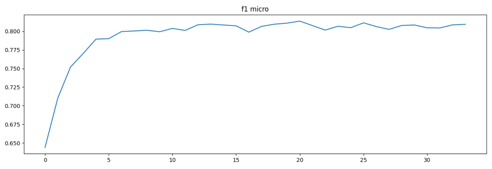

# BERT + CRF for [RuREBus](https://github.com/dialogue-evaluation/RuREBus.git)

The main goal of this task is to train BERT-CRF model for solving Named Entity Recognition and Relation Extraction tasks
on RuREBus dataset (_Russian Relation Extraction for Business_).


#### Table of content
* [Structure](#structure)
* [Requirements](#requirements)
* [Named Entity Recognition](#ner)
  * [Data for NER](#ner-data)
  * [BERT + CRF](#ner-model)
* [Relation extraction](#re)
  * [Data for RE](#re-data)
  * [Relation classifier](#re-model)
* [Experiments and results](#experiments)
  * [NER](#ner-results)
  * [RE](#re-results)

### <a name="structure"></a>Structure
* [`datasets`](./datasets) – implementations of torch datasets.
* [`models`](./models) – models implementation (bert+crf, classifier for RE task solving)
* [`re_utils`](./re_utils) – various useful utilities (e.g. for working with files, ner data structure, for training models).
* [`resources`](./resources) – materials for the design of the repository, it is also supposed to store data there for training and testing models.
* [`RuREBus`](https://github.com/dialogue-evaluation/RuREBus.git) – repository with original task.
* [`scripts`](./scripts) – scripts for preparing data to training and evaluation.
* [`ner_experiments.ipynb`](./ner_experiments.ipynb) – training different models to solve NER task.
* [`re_experiments.ipynb`](./re_experiments.ipynb) – training model to solve RE task.

### <a name="requirements"></a>Requirements

Create virtual environment with `venv` or `conda` and install requirements:

```shell
pip install -r requirements.txt
```

Or build and run docker container:
```shell
./run_docker.sh
```

## <a name="ner"></a>Named Entity Recognition

### <a name="ner-data"></a>Data
_"The corpus contains regional reports and strategic plans. A part of the corpus is annotated with named entities (8 classes) and semantic relations (11 classes). In total there are approximately 300 annotated documents. The annotation schema and the guidelines for annotators can be found in here (in Russian)."_

from [RuREBus](https://github.com/dialogue-evaluation/RuREBus.git) repo

#### BERT Finetuning via Masked Language Modeling (MLM)
There are a lot of Russian pretrained language models, the most popular one is
[sberbank/ruBERT-base](https://huggingface.co/sberbank-ai/ruBert-base). In order to get a higher quality when solving
_NER_ and _RE_ on the RuREBus dataset, we've applied masked language modeling to sberbank/ruBERT-base model.
The dataset for finetunning was chosen from the same domain: https://disk.yandex.ru/d/9uKbo3p0ghdNpQ

1. Create masked dataset for BERT finetunning:
   ```shell
   $ python scripts/mask_texts.py 
   ```
2. Running train script with created dataset:
   ```shell
   $ python scripts/mlm.py
   ```

#### NER labeled datasets
The [training data](https://github.com/dialogue-evaluation/RuREBus/tree/master/train_data) is provided in the repository RuREBus. The data needs to be unpacked, this can be done using a script:
```shell
./unzip_data.sh
```
Next, the data must be processed by the script [scripts/tokenize_texts.py](./scripts/tokenize_texts.py):
```shell
python -m scripts.tokenize_texts
```

This script tokenizes the text using the tokenizer passed in the parameter `--hf-tokenizer` (default: _sberbank-ai/ruBert-base_).
The script also breaks the texts into pieces, the size of which does not exceed `--max-seq-len` (default: _512_) tokens. In this case, the script is smart not to break a word consisting of several tokens in the middle, moreover, if a named entity consists of several words, then it will not be broken in the middle. The resulting pieces can be of different sizes, when processing this data by the dataloader, shorter sequences are padded.

This script creates 4 files in the same directory as the text and annotation data (`--dir` parameter, default: _resources/data/train_):
* `labeled_texts.jsonl` – the file consists of lines, each line has the following form:
   ```
   {"input_ids": [113, 1947, 672, 73324, ..., 152, 64306], "text_labels": ["O", "O", "B-QUA", "I-QUA", ..., "O", "O"], "labels": [0, 0, 15, 10, ..., 0, 0], "id": 0}
   ```
   * `id` – index of a piece of text in the dataset
   * `input_ids` – token ids received by the tokenizer
   * `text_labels` – named entity labels for tokens. Labels are assigned to tokens according to the BIO system: in this case, if the token does not belong to the named entity, then it is marked with the "O" label; the label of the first named entity token is prefixed with "B-"; other named entity tokens begin with "I-". The corresponding prefix is followed by a tag denoting the class of the named entity.
   * `labels` – `text_labels` converted to numbers

* `label2id.jsonl` – mapping from a label's text representation to a number, e.g:
   ```
   {"O": 0, "B-ECO": 1, "B-CMP": 2, "I-SOC": 3, "I-INST": 4, "B-INST": 5, ...}
   ```
* `relations.jsonl`, `retag2id.json` – more details about these files are described in the **Data** subsection of the **Relation Extraction** section.

### <a name="ner-model"></a>Model

The outputs of the [BERT](https://arxiv.org/abs/1810.04805) model pretrained on the corpus of business texts are processed using [Conditional Random Field](http://www.cs.columbia.edu/~mcollins/crf.pdf).

The essence of CRF is to build a probabilistic model $$p(y_0...y_{m - 1}|\overrightarrow{x_0}...\overrightarrow{x_{m - 1}}) = p(\overrightarrow{y}|\overrightarrow{x})$$ where $y_i$ – token label, $x_i$ – token embedding obtained using BERT.

The key idea of CRF is the definition of a feature vector $$\overrightarrow{\Phi}(\overrightarrow{x}, \overrightarrow{y}) \in \mathbb{R}^d$$

The function maps a pair of the input sequence and the label sequence to some feature vector in d-dimensional space.

The probabilistic model is built as follows: $$p(\overrightarrow{y}|\overrightarrow{x}) = \frac{\exp(\overrightarrow{\Phi}(\overrightarrow{x}, \overrightarrow{y}))}{\sum\limits_{\overrightarrow{y'} \in \mathcal{Y}^m} \exp(\overrightarrow{\Phi}(\overrightarrow{x},\overrightarrow{y'}))}$$
where $\mathcal{Y}^m$ – the set of all possible token label sequences of length $m$.

The function $\overrightarrow{\Phi}(\overrightarrow{x}, \overrightarrow{y})$ is defined as follows: $$\overrightarrow{\Phi}(\overrightarrow{x}, \overrightarrow{y}) = \sum\limits_{i=0}^{m - 1} \log \psi_i(\overrightarrow{x}, i, y_{i - 1}, y_i)$$

$\log \psi_i$ consists of two parts: the first is the value of the corresponding logit that comes from BERT's embeddings, and the second is the transition potential from the previous $s$ value to the new one. This value is obtained from a square matrix of learning parameters with a side of size `num type of labels`.

$$\overrightarrow{\Phi}(\overrightarrow{x}, \overrightarrow{y}) = \log \psi_{\texttt{EMIT}} (y_0 \rightarrow x_0) + \sum\limits_{i=1}^{m - 1} \log \psi_{\texttt{EMIT}} (y_i \rightarrow x_i)  + \log \psi_{\texttt{TRANS}} (y_{i - 1} \rightarrow y_i)$$

During training, negative log-likelihood is minimized:
$$\texttt{NLL} = - \sum\limits_{i = 0}^{n - 1} \log(p(\overrightarrow{y}^i | \overrightarrow{x}^i))$$
where $x_i$, $y_i$ is an $i^{th}$ example from the training set.

The question is how to effectively calculate the sum over all possible sequences $y'$ in the denominator. This is done using **dynamic programming**.

#### Denominator calculation

Let $\pi[i][y]$ be logarith of the sum of all label sequences $\log\sum\limits_{\overrightarrow{y'} \in \mathcal{Y}^m} \exp(\overrightarrow{\Phi}(\overrightarrow{x},\overrightarrow{y'}))$ of length $i + 1$ ( $i \in \{ 0,...,m - 1 \} $)  ending in a label $y$. Then 

$$\overrightarrow{\pi[0]} = \overrightarrow{tr_{\texttt{start}}} + \overrightarrow{x_0}$$

The calculation for the indices 1..m - 1 will be better understood from the figure:


$$\pi[i-1][j] = \log \sum\limits_{y' \in \mathcal{Y}^{i}, y'_{-1} = \mathcal{Y}[j]} \exp(\sum\limits_{k = 0}^{i - 1} \log \psi_{\texttt{EMIT}} (y'_k \rightarrow x_k)  + \log \psi_{\texttt{TRANS}} (y'_{k - 1} \rightarrow y'_k))$$

$$\pi[i][j] = \log \sum\limits_{t = 0} ^ {|\mathcal{Y}| - 1} \exp (\pi[i - 1][t] + \log \psi_{\texttt{EMIT}} (y_i \rightarrow x_i)  + \log \psi_{\texttt{TRANS}} (\mathcal{Y}[t] \rightarrow \mathcal{Y}[j]))$$

$$\displaylines{\pi[i][j] = \log \sum\limits_{t = 0} ^ {|\mathcal{Y}| - 1} \exp (\log \sum\limits_{y' \in \mathcal{Y}^{i}, y'_{-1} = \mathcal{Y}[t]} \exp(\sum\limits_{k = 0}^{i - 1} \log \psi_{\texttt{EMIT}} (y'_k \rightarrow x_k)  + \log \psi_{\texttt{TRANS}} (y'_{k - 1} \rightarrow y'_k)) \\\ + \log \psi_{\texttt{EMIT}} (y_i \rightarrow x_i)  + \log \psi_{\texttt{TRANS}} (\mathcal{Y}[t] \rightarrow \mathcal{Y}[j]))}$$

$$\displaylines{\pi[i][j] = \log \sum\limits_{t = 0} ^ {|\mathcal{Y}| - 1} \exp (\log (\sum\limits_{y' \in \mathcal{Y}^{i}, y'_{-1} = \mathcal{Y}[t]} \exp(\sum\limits_{k = 0}^{i - 1} \log \psi_{\texttt{EMIT}} (y'_k \rightarrow x_k) + \log \psi_{\texttt{TRANS}} (y'_{k - 1} \rightarrow y'_k)) \\\ \cdot \psi_{\texttt{EMIT}} (y_i \rightarrow x_i) \cdot \psi_{\texttt{TRANS}} (\mathcal{Y}[t] \rightarrow \mathcal{Y}[j])))}$$

$$\displaylines{\pi[i][j] = \log \sum\limits_{t = 0} ^ {|\mathcal{Y}| - 1} \sum\limits_{y' \in \mathcal{Y}^{i}, y'_{-1} = \mathcal{Y}[t]} \exp(\sum\limits_{k = 0}^{i - 1} \log \psi_{\texttt{EMIT}} (y'_k \rightarrow x_k) + \log \psi_{\texttt{TRANS}} (y'_{k - 1} \rightarrow y'_k)) \\\ \cdot \psi_{\texttt{EMIT}} (y_i \rightarrow x_i) \cdot \psi_{\texttt{TRANS}} (\mathcal{Y}[t] \rightarrow \mathcal{Y}[j])}$$

$$\displaylines{\pi[i][j] = \log \sum\limits_{t = 0} ^ {|\mathcal{Y}| - 1} \sum\limits_{y' \in \mathcal{Y}^{i}, y'_{-1} = \mathcal{Y}[t]} \exp(\log\psi_{\texttt{EMIT}} (y_i \rightarrow x_i) + \log\psi_{\texttt{TRANS}} (\mathcal{Y}[t] \rightarrow \mathcal{Y}[j]) \\\ + \sum\limits_{k = 0}^{i - 1} \log \psi_{\texttt{EMIT}} (y'_k \rightarrow x_k) + \log \psi_{\texttt{TRANS}} (y'_{k - 1} \rightarrow y'_k))}$$

$$\pi[i][j] = \log \sum\limits_{y' \in \mathcal{Y}^{i + 1}, y'_{-1} = \mathcal{Y}[j]} \exp(\sum\limits_{k = 0}^{i} \log \psi_{\texttt{EMIT}} (y'_k \rightarrow x_k) + \log \psi_{\texttt{TRANS}} (y'_{k - 1} \rightarrow y'_k))$$

At the end, we add a potential vector, which is responsible for the probability of ending the sequence with the last token.

$$\log \sum\limits_{\overrightarrow{y'} \in \mathcal{Y}^m} \exp(\overrightarrow{\Phi}(\overrightarrow{x},\overrightarrow{y'})) = \log \sum\limits_{t = 0}^{|\mathcal{Y}| - 1} \pi[m][t] + tr_{\texttt{end}}[t]$$

Since when recalculating the vector $\overrightarrow{\pi[i]}$ we use only the previous vector $\overrightarrow{\pi[i - 1]}$, we may not store the entire matrix $\pi$, but only the last vector.

If we take into account that gradient descent uses batches, then the calculation of the denominator in $\texttt{NLL}$ looks like this:

```python
def compute_log_denominator(self, x: torch.Tensor) -> torch.Tensor:
    m = x.shape[0]

    pi = self.tr_start + x[0]

    # x.shape == [seq_len, batch_size, num_type_of_labels]
    # pi.shape == [batch_size, num_type_of_labels]
    # self.tr.shape == [num_type_of_labels, num_type_of_labels]

    for i in range(1, m):
        pi = torch.logsumexp(
            pi.unsqueeze(2) + self.tr + x[i].unsqueeze(1),
            dim=1,
        )

    pi += self.tr_end
    return torch.logsumexp(pi, dim=1)
```

#### Decoding with CRF

To get a sequence of labels for tokens from the hidden representation of the BERT $\overrightarrow{x_0}...\overrightarrow{x_{m - 1}}$, we need to find the most likely $s_0,...,s_{m - 1}$, i.e. $\mathop{\operatorname{argmax}}\limits_{\overrightarrow{y} \in \mathcal{Y}^{m}} p(\overrightarrow{y}|\overrightarrow{x})$.

We can simplify the expression as follows:

$$\mathop{\operatorname{argmax}}\limits_{\overrightarrow{y} \in \mathcal{Y}^{m}} p(\overrightarrow{y}|\overrightarrow{x}) = \mathop{\operatorname{argmax}}\limits_{\overrightarrow{y} \in \mathcal{Y}^{m}} \frac{\exp(\overrightarrow{\Phi}(\overrightarrow{x}, \overrightarrow{y}))}{\sum\limits_{\overrightarrow{y'} \in \mathcal{Y}^m} \exp(\overrightarrow{\Phi}(\overrightarrow{x}, \overrightarrow{y'})))}$$

$$= \mathop{\operatorname{argmax}}\limits_{\overrightarrow{y} \in \mathcal{Y}^m} exp(\overrightarrow{\Phi}(\overrightarrow{x}, \overrightarrow{y}))$$

$$= \mathop{\operatorname{argmax}}\limits_{\overrightarrow{y} \in \mathcal{Y}^m} \overrightarrow{\Phi}(\overrightarrow{x}, \overrightarrow{y})$$

$$= \mathop{\operatorname{argmax}}\limits_{\overrightarrow{y} \in \mathcal{Y}^m} \sum\limits_{i=0}^{m - 1} \log \psi_i(\overrightarrow{x}, i, y_{i - 1}, y_i)$$

The decoding problem is to find an entire sequence of labels such that the sum of potentials is maximized. The problem is also solved using **dynamic programming**.

All formulas are similar to those used when calculating the denominator in $\texttt{NLL}$, but the logarithm of the sum of the exponents is replaced by the maximum function and $pi[t]$ stores the maximum value of the sum of a sequence of length $i + 1$ ($i$ – current step, $i \in {0, ..., m - 1}$) that ends with the label $\mathcal{Y}[t]$. In code it looks like this:

```python
def viterbi_decode(self, x: torch.Tensor) -> List[List[int]]:
    m, bs, num_type_of_labels = x.shape

    pi = self.tr_start + x[0]

    backpointers = torch.empty_like(x)

    # x.shape == [seq_len, batch_size, num_type_of_labels]
    # pi.shape == [batch_size, num_type_of_labels]
    # self.tr.shape == [num_type_of_labels, num_type_of_labels]

    for i in range(1, m):
        pi = (
            pi.unsqueeze(2) + self.tr + x[i].unsqueeze(1)
        ) # shape = [batch_size, num_type_of_labels, num_type_of_labels]
        
        
        pi, indices = pi.max(dim=1) # for each next label, determine from which it is most profitable to come to it.
        backpointers[i] = indices

    backpointers = backpointers[1:].int()

    pi += self.tr_end
```

From the obtained `backpointers`, it is easy to restore the path and the corresponding sequence of labels.

## <a name="re"></a>Relation Extraction

### <a name="re-data"></a>Data

By running the script [scripts/tokenize_texts.py](./scripts/tokenize_texts.py) described in the **Data** subsection of the **NER** section, among others,
two files are obtained that describe the relationships between entities in the data:
* `relations.jsonl` – for each text all relations are described
  ```
  {"id": 3, "relations": [{"arg1_tag": "BIN", "arg2_tag": "ACT", "arg1_pos": [135, 136], "arg2_pos": [142, 149], "re_tag": "TSK", "tag": 1}]}
  ```
  * `id` – index of a piece of text in the dataset
  * `arg1_tag` – the tag of the named entity that is the first argument to the relation
  * `arg2_tag` – the tag of the named entity that is the second argument to the relation
  * `arg1_pos` – the position of the first argument in the text, the indexes of tokens are indicated (not symbols and not words!), the named entity lies in the half-interval `[arg1_pos[0], arg1_pos[1])`
  * `arg2_pos` – similar for the second argument
  * `re_tag` – relationship tag string value
  * `tag` – id tag relationship
* `retag2id.jsonl` – mapping from a relation tag's text representation to a number, e.g:
  
  ```{"PPS": 0, "TSK": 1, "NNG": 2, "FNG": 3, "GOL": 4, "FPS": 5,...}```

These files, as well as the trained model for NER, are used to compile a dataset for training the relationship detection model.

This data is prepared using a script [scripts/prepare_data_for_re.py](./scripts/prepare_data_for_re.py)

```shell
python -m scripts.prepare_data_for_re
```

This script creates two files:

* `re_data.jsonl` – relationships between entities that the model has identified for the detection of named entities. Each line of the file is a dictionary, which consists of the following fields:
  * `id` – index of a piece of text in the dataset
  * `seq_embedding` – embedding the entire piece of text
  * `entities_embeddings` – embeddings of named entities highlighted by the NER model.
  * `relation_matrix` – matrix of relations between tokens allocated by the NER model: `relation_matrix[i][j] = tag_id` if there is a relationship between $i^{th}$ and $j^{th}$ entities from the array `entities_tags` that has `tag` with id `tag_id` (according to the file `retag2id.jsonl`).
  * `entities_tags` – tags of selected named entities by the NER model (without `B-`, `I-` prefixes).
  * `entities_positions` – positions of entities highlighted by the NER model in the same format as for keys `arg1_pos`, `arg2_pos` in the file `relations.jsonl` $$
  
* `entity_tag_to_id.json` – mapping from an entity tag's text representation to a number, e.g:
  
  ```{"SOC": 0, "ECO": 1, "ACT": 2, "CMP": 3, "MET": 4, ...}```

### <a name="re-model"></a>Model

The idea for the model was taken from the article [Enriching Pre-trained Language Model with Entity Information for Relation Classification](https://arxiv.org/abs/1905.08284)


The input model recieves fields `seq_embedding`, `entities_embeddings`, `entities_tags` from a file `re_data.jsonl` and evaluates the relationship tag for each pair of named entities (or lack of relationship) according to the scheme from the figure above.

A relationship matrix is built and the cross entropy between the prediction matrix and the ground truth `relation_matrix` from the file `re_data.jsonl` is calculated.

## <a name="experiments"></a>Experiments and results

### <a name="ner-results"></a>BERT-CRF for Named Entity Recognition (NER):

In [ner_experiments.ipynb](ner_experiments.ipynb) notebook we've provide code for training different version of BERT model.
Our finetunned BERT with CRF layer shows the best f1-micro score.

* ruBERT
  
* ruBERT + CRF
  
* ruREBus-BERT
  
* ruREBus-BERT + CRF
  

|          | ruBERT | ruBERT + CRF | ruREBus-BERT | ruREBus-BERT + CRF |
|----------|--------|--------------|--------------|--------------------|
| f1-micro | 0.8046 | 0.8092       | 0.8119       | **0.8128**         |

### <a name="re-results"></a>BERT-CRF for Relation Extraction (RE):

#### Honset F1
Since the text was broken into pieces no larger than 512 tokens, for some relations the arguments ended up in different pieces of text.
For the test dataset, there were _248_ such lost relationships. We consider them undetected by the model and assign them to `false negative`.
The remaining `false negative` examples were calculated by comparing the file `relations.jsonl` with the relation matrix predicted by the model.

`true positive` and `false positive` were calculated by comparing predicted relation matrix with ground truth relation matrix from `re_data.jsonl` file.

$$\texttt{F1} = \frac{\texttt{true positive}}{\texttt{true positive} + \frac{1}{2} \cdot (\texttt{false positive} + \texttt{false negative})}$$


Due to the lost relations and errors of the NER model, the value of f1-micro turned out to be not very large:

f1-micro = **0.2636**
