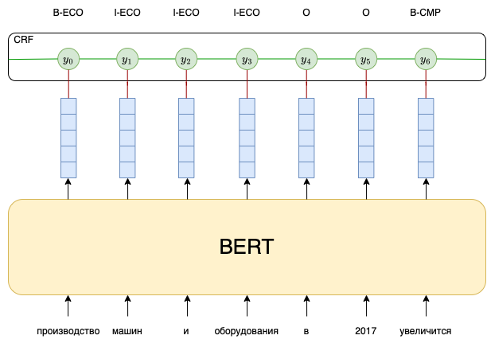

# BERT + CRF for [RuREBus](https://github.com/dialogue-evaluation/RuREBus.git)

The main goal of this task is to train BERT-CRF model for solving Named Entity Recognition and Relation Extraction tasks
on RuREBus dataset (_Russian Relation Extraction for Business_).



### Structure
* [`datasets`](./datasets) – implementations of torch datasets.
* [`models`](./models) – models implementation (bert+crf, classifier for RE task solving)
* [`re_utils`](./re_utils) – various useful utilities (e.g. for working with files, ner data structure, for training models).
* [`resources`](./resources) – materials for the design of the repository, it is also supposed to store data there for training and testing models.
* [`RuREBus`](https://github.com/dialogue-evaluation/RuREBus.git) – repository with original task.
* [`scripts`](./scripts) – scripts for preparing data to training and evaluation.
* [`ner_experiments.ipynb`](./ner_experiments.ipynb) – training different models to solve NER task.
* [`re_experiments.ipynb`](./re_experiments.ipynb) – training model to solve RE task.

### Requirements

Create virtual environment with `venv` or `conda` and install requirements:

```shell
pip install -r requirements.txt
```

Or build and run docker container:
```shell
./run_docker.sh
```

## Named Entity Recognition

### Data
_"The corpus contains regional reports and strategic plans. A part of the corpus is annotated with named entities (8 classes) and semantic relations (11 classes). In total there are approximately 300 annotated documents. The annotation schema and the guidelines for annotators can be found in here (in Russian)."_

from [RuREBus](https://github.com/dialogue-evaluation/RuREBus.git) repo

#### BERT Finetuning via Masked Language Modeling (MLM)
There are a lot of Russian pretrained language models, the most popular one is
[sberbank/ruBERT-base](https://huggingface.co/sberbank-ai/ruBert-base). In order to get a higher quality when solving
_NER_ and _RE_ on the RuREBus dataset, we've applied masked language modeling to sberbank/ruBERT-base model.
The dataset for finetunning was chosen from the same domain: https://disk.yandex.ru/d/9uKbo3p0ghdNpQ

1. Create masked dataset for BERT finetunning:
   ```shell
   $ python scripts/mask_texts.py 
   ```
2. Running train script with created dataset:
   ```shell
   $ python scripts/mlm.py
   ```

#### NER labeled datasets
The [training data](https://github.com/dialogue-evaluation/RuREBus/tree/master/train_data) is provided in the repository RuREBus. The data needs to be unpacked, this can be done using a script:
```shell
./unzip_data.sh
```
Next, the data must be processed by the script [scripts/tokenize_texts.py](./scripts/tokenize_texts.py):
```shell
python -m scripts.tokenize_texts
```

This script tokenizes the text using the tokenizer passed in the parameter `--hf-tokenizer` (default: _sberbank-ai/ruBert-base_).
The script also breaks the texts into pieces, the size of which does not exceed `--max-seq-len` (default: _512_) tokens. In this case, the script is smart not to break a word consisting of several tokens in the middle, moreover, if a named entity consists of several words, then it will not be broken in the middle. The resulting pieces can be of different sizes, when processing this data by the dataloader, shorter sequences are padded.

This script creates 4 files in the same directory as the text and annotation data (`--dir` parameter, default: _resources/data/train_):
* `labeled_texts.jsonl` – the file consists of lines, each line has the following form:
   ```
   {"input_ids": [113, 1947, 672, 73324, ..., 152, 64306], "text_labels": ["O", "O", "B-QUA", "I-QUA", ..., "O", "O"], "labels": [0, 0, 15, 10, ..., 0, 0], "id": 0}
   ```
   * `id` – index of a piece of text in the dataset
   * `input_ids` – token ids received by the tokenizer
   * `text_labels` – named entity labels for tokens. Labels are assigned to tokens according to the BIO system: in this case, if the token does not belong to the named entity, then it is marked with the "O" label; the label of the first named entity token is prefixed with "B-"; other named entity tokens begin with "I-". The corresponding prefix is followed by a tag denoting the class of the named entity.
   * `labels` – `text_labels` converted to numbers

* `label2id.jsonl` – mapping from a tag's text representation to a number, e.g:
   ```
   {"O": 0, "B-ECO": 1, "B-CMP": 2, "I-SOC": 3, "I-INST": 4, "B-INST": 5, ...}
   ```
* `relations.jsonl`, `retag2id.json` – more details about these files are described in the **Data** subsection of the **Relation Extraction** section.

### Models

The outputs of the [BERT](https://arxiv.org/abs/1810.04805) model pretrained on the corpus of business texts are processed using [Conditional Random Field](http://www.cs.columbia.edu/~mcollins/crf.pdf).

The essence of CRF is to build a probabilistic model $$p(y_1...y_m|x_1...x_m) = p(\overrightarrow{y}|\overrightarrow{x})$$ where $y_i$ – token label, $x_i$ – token embedding obtained using BERT.

The key idea of CRF is the definition of a feature vector $$\overrightarrow{\Phi}(\overrightarrow{x}, \overrightarrow{y}) \in \mathbb{R}^d$$

The function maps a pair of the input sequence and the label sequence to some feature vector in d-dimensional space.

The probabilistic model is built as follows: $$p(\overrightarrow{y}|\overrightarrow{x}) = \frac{\exp(\overrightarrow{\Phi}(\overrightarrow{x}, \overrightarrow{y}))}{\sum\limits_{\overrightarrow{y'} \in \mathcal{Y}} \exp(\overrightarrow{\Phi}(\overrightarrow{x},\overrightarrow{y'}))}$$
where $\mathcal{Y}^m$ – the set of all possible token label sequences.

The function $\overrightarrow{\Phi}(\overrightarrow{x}, \overrightarrow{y})$ is defined as follows: $$\overrightarrow{\Phi}(\overrightarrow{x}, \overrightarrow{y}) = \sum\limits_{i=1}^m \log \psi_i(\overrightarrow{x}, i, y_{i - 1}, y_i)$$

$\log \psi_i$ consists of two parts: the first is the value of the corresponding logit that comes from BERT's embeddings, and the second is the transition potential from the previous $s$ value to the new one. This value is obtained from a square matrix of learning parameters with a side of size `num type of labels`.

$$\overrightarrow{\Phi}(\overrightarrow{x}, \overrightarrow{y}) = \sum\limits_{i=1}^m \log \psi_{\texttt{EMIT}} (y_i \rightarrow x_i)  + \log \psi_{\texttt{TRANS}} (y_{i - 1} \rightarrow y_i)$$

During training, negative log-likelihood is minimized:
$$\texttt{NLL} = - \sum\limits_{i = 1}^n \log(p(\overrightarrow{y}^i | \overrightarrow{x}^i))$$
where $x_i$, $y_i$ is an $i^{th}$ example from the training set.

The question is how to effectively calculate the sum over all possible sequences $y'$ in the denominator. This is done using dynamic programming.

Let $\pi[i][y]$ be logarith of the sum of all label sequences $\log\sum\limits_{\overrightarrow{y'} \in \mathcal{Y}} \exp(\overrightarrow{\Phi}(\overrightarrow{x},\overrightarrow{y'}))$ of length $i + 1$ ( $i \in \{ 0,...,m \} $)  ending in a label $y$. Then 

$$\overrightarrow{\pi[0]} = \overrightarrow{tr_{\texttt{start}}} + \overrightarrow{x_0}$$

The calculation for the indices 1..m will be better understood from the figure:


$$\pi[i-1][j] = \log \sum\limits_{y' \in \mathcal{Y}^{i}, y'_{-1} = \mathcal{Y}[j]} \exp(\sum\limits_{k = 0}^{i - 1} \log \psi_{\texttt{EMIT}} (y_k \rightarrow x_k)  + \log \psi_{\texttt{TRANS}} (y_{k - 1} \rightarrow y_k))$$

$$\pi[i][j] = \log \sum\limits_{t = 0} ^ {|\mathcal{Y}| - 1} \exp (\pi[i - 1][t] + \log \psi_{\texttt{EMIT}} (y_i \rightarrow x_i)  + \log \psi_{\texttt{TRANS}} (\mathcal{Y}[t] \rightarrow \mathcal{Y}[j]))$$

$$\pi[i][j] = \log \sum\limits_{t = 0} ^ {|\mathcal{Y}| - 1} \exp (\log \sum\limits_{y' \in \mathcal{Y}^{i}, y'_{-1} = \mathcal{Y}[t]} \exp(\sum\limits_{k = 0}^{i - 1} \log \psi_{\texttt{EMIT}} (y_k \rightarrow x_k)  + \log \psi_{\texttt{TRANS}} (y_{k - 1} \rightarrow y_k)) + \log \psi_{\texttt{EMIT}} (y_i \rightarrow x_i)  + \log \psi_{\texttt{TRANS}} (\mathcal{Y}[t] \rightarrow \mathcal{Y}[j]))$$

$$\pi[i][j] = \log \sum\limits_{t = 0} ^ {|\mathcal{Y}| - 1} \exp (\log (\sum\limits_{y' \in \mathcal{Y}^{i}, y'_{-1} = \mathcal{Y}[t]} \exp(\sum\limits_{k = 0}^{i - 1} \log \psi_{\texttt{EMIT}} (y_k \rightarrow x_k) + \log \psi_{\texttt{TRANS}} (y_{k - 1} \rightarrow y_k)) \cdot \psi_{\texttt{EMIT}} (y_i \rightarrow x_i) \cdot \psi_{\texttt{TRANS}} (\mathcal{Y}[t] \rightarrow \mathcal{Y}[j])))$$

$$\pi[i][j] = \log \sum\limits_{t = 0} ^ {|\mathcal{Y}| - 1} \sum\limits_{y' \in \mathcal{Y}^{i}, y'_{-1} = \mathcal{Y}[t]} \exp(\sum\limits_{k = 0}^{i - 1} \log \psi_{\texttt{EMIT}} (y_k \rightarrow x_k) + \log \psi_{\texttt{TRANS}} (y_{k - 1} \rightarrow y_k)) \cdot \psi_{\texttt{EMIT}} (y_i \rightarrow x_i) \cdot \psi_{\texttt{TRANS}} (\mathcal{Y}[t] \rightarrow \mathcal{Y}[j])$$

## Relation Extraction

==========================

### BERT-CRF for Named Entity Recognition (NER):

In [experiments.ipynb](experiments.ipynb) notebook we've provide code for training different version of BERT model.
Our finetunned BERT with CRF layer shows the best F1-Micro score.

|          | ruBERT | ruBERT + CRF | ruREBus-BERT | ruREBus-BERT + CRF |
|----------|--------|--------------|--------------|--------------------|
| F1-micro | 0.8023 | 0.8057       | 0.8052       | **0.8122**         |

### BERT-CRF for Relation Extraction (RE):

